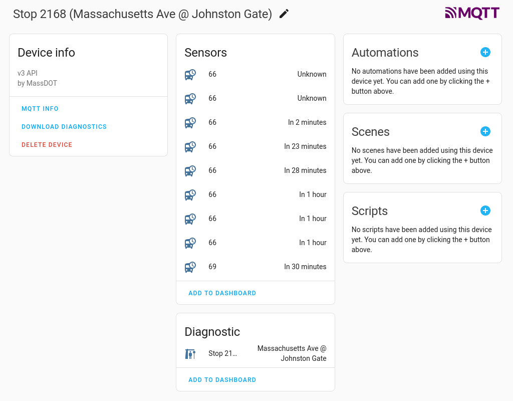

mbta2mqtt
=========

`mbta2mqtt` is a bridge between the MBTA's 
[real-time data API](https://api-v3.mbta.com/) and MQTT.

It's meant to be very lightweight, and as a core principle
_keeps no state_. It just gets updates and sends them on.


Essential Configuration
-----------------------

While you can make requests to the MBTA API without an API
key, this uses the streaming API. And that requires an
API key. You can get one from
[the MBTA developer portal](https://api-v3.mbta.com/register).

The default config expects this to be stored in an
environment variable `MBTA_API_KEY`. You can also just
put it in the config file.

You'll also need the hostname and port of your MQTT broker
(like [Mosquitto](https://mosquitto.org/). If you're using
localhost on the default port with no authnetication, this
will just work with the defaults.

And, you'll need a list of MBTA stops by number. **As of
right now, I've only tested this with the bus.**
Theoretically it should work with the subway too, and for
that matter commuter rail, but I haven't tested it and
there are probably related bugs.

Stop IDs are easy to find: search on 
[mbta.com](https://www.mbta.com/) and then look at the
number in the URL. Like, _Massachusetts Ave @ Newbury St_
is https://www.mbta.com/stops/93 — stop `93`.

This is true for T stations, too. For example, Central
Square in Cambridge is https://www.mbta.com/stops/place-cntsq,
and the corresponding stop ID is `place-cntsq`.

Be aware that bus stop numbers just cover one side
of the street — one direction. The opposite side
will be an entirely different stop.

Running as a Container
----------------------

After you get your [API key](https://api-v3.mbta.com/register),
add that as a _secret_:

```
printf api_key_string | podman secret create MBTA_API_KEY -
```

(Replacing `api_key_string` with the actual hex string, of
course.) Then, use `podman run` something like this:


```
podman run --secret=MBTA_API_KEY,type=env \
    --net=host --volume .:/var/log/mbta2mqtt:Z \
    quay.io/mattdm/mbta2mqtt /opt/mbta2mqtt/mbta2mqtt.py \
    place-davis place-portr
```

... where `place-davis` and `place-portr` are the stops
you want predictions for. This will write logs to `.` —
the current directory. For "real" use, you'll want to
change that to something else.

This should "just work" if your MQTT broker is running
on `localhost:1883`. Otherwise (and in general because
you will probably want to make some other changes),
copy [`example.conf`](example.conf) to a location on
your host of your chosing, and put that into the 
container with
`----volume /location/mbta2mqtt.conf:/etc/mbta2mqtt/mbta2mqtt.conf`.
And you'll want to change the log output volume
mount, too!

For actual use, add `--detatch` (or just `-d`) to
run in the background, and (see below) probably also
`--restart=on-failure`, unless you're using systemd
or some other service manager.


More Configuration
------------------

Take a look at [`defaults.conf`](defaults.conf).
Everything that's there can be overridden or 
extended by a further configuration file, like
`/etc/mbta2mqtt/mbta2mqtt.conf`.


What's Tracked?
---------------

It's important to be aware that we are not tracking the
state of the whole MBTA system.

We're only getting updates for resources associated with
the stops listed in the configuration — and then the
resources associated with _those_ So, for example, we don't
know about every bus on a route, just ones that there are
currently predictions for that are associated with one of
these stops.

However, this cascades — we get updates for all of the
related resources. That means you'll see messages (and
Home Assistant entities) for other stops on any route
that has a prediction associated with your configured 
list of stops.

So, you'll see lots of stops and other entries that seem
random. They're not really random, though — they're there
because they're referenced by something (maybe going
through several degrees of separation). You might need
them if, for exxample, you want to find the name of the
stop where your (hoped-to-be) future bus is _right now_.

Since data is passed through with minimal processing,
you can find the description and details for each resource
type in the
[MBTA v3 API docs](https://api-v3.mbta.com/docs/swagger/index.html).
(I'd link directly, but that's not possible
^[issue: https://github.com/swagger-api/swagger-ui/issues/1369],
so... scroll down to Models and find each one.)

* AlertResource
* LineResource
* RredictionResource
* RouteResource
* StopResource
* TripResource
* VehicleResource


Error Handling
--------------

Again, an opinionated choice: the basic approach to dealing
with HTTP or MQTT errors is to log them and quit, rather
than trying to recover.

I expect that this will run in a container or under some
other service management, which should then just restart
(possibly with some kind of increasing delay).

At the next startup, the MBTA API will send a 'reset'
message, and so everything should be cleaned up and ready
to go.


Home Assistant Integration
--------------------------

`mbta2mqtt` sends
[MQTT Discovery](https://www.home-assistant.io/docs/mqtt/discovery/)
messages for Home Assistant. If you have MQTT set up, this
will create (and of course update) sensor entities which represent
the real-time data resources sent by the T.

These sensor entities will (as configured by default) be named
using the prefix `mbta`, followed by one of the resource types
as described above, followed by the particular name of that
thing. For example: `sensor.mbta_route_90`.

The )useful_ information for these entities is stored as 
[attributes](https://www.home-assistant.io/docs/configuration/state_object/#attributes).
I've also tried to set the _state_ for each entity type 

We also set up a 
[device](https://developers.home-assistant.io/docs/device_registry_index/)
corresponding to the stops you're following, for convienience
and visability. Not all entities will be attached to this device,
because it's kind of overwhelming if we do that. And remember,
that will icnlude entities for _other_ stops that you're not
getting predictions for.

When `mbta2mqtt` exits cleanly, it will remove all entities
and devices. (It'll also do this when it starts, so it doesn't
leave old stuff around.)


What's Not Here?
----------------

So, again, nothing tracks state. As it is, the Home Assistant
device associated with a stop is kind of useful — it shows 
the predictions with bus lines and times:



However, there is _a lot more_ buried in the `attributes`
of the prediction sensors, and even more in attributes of
entities which aren't associated with the device. For example,
the prediction might have an assocated active alert. But
the attributes just show the alert number. You need to
find the entity for that — its will be `sensor.mbta_alert_NNNN`,
where `NNNN` is the number — to see the details.

A _useful_ dashboard would display all of this.

My current two competing ideas are:

1. Create template sensors and templated dashboard
   views in Home Assistant with all the proper connections.

2. Make a separate little service which _does_ keep
   state, at least in-memory, and which creates more useful
   Home Assistant sensors and devices.

Or maybe it's best to just make a whole (separate) Home Assistant
integration.


TODO
----

Current big rough list:

1. Write some home assistant template entities.
2. And a dashboard card.
3. Refactor code to make less hacky, y'know?
4. Make some control stuff _from_ Home Assistant.
   - change / set stops
   - restart

There are plenty of other things to address, of course!


Contributions?
--------------

Yes, please! However, I definitely don't have the spare time to
make this a big project. If you'd like to actually _own_ this, or
are inspired by my hacky code to make something better, let's
talk!
